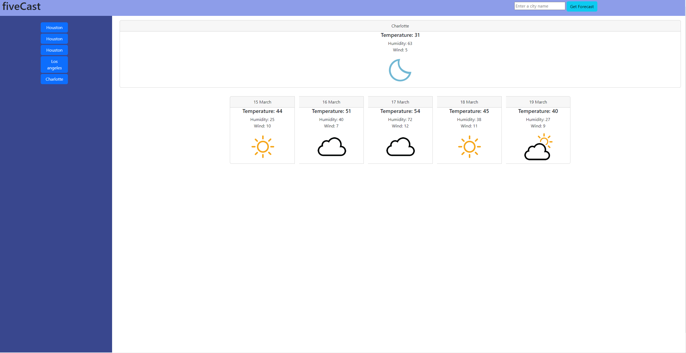

# fiveCast

  

## Description

A dashboard that allows the user to look up current and future weather conditions for any given city.

## Table of Contents

- [Screenshot](#screenshot)
- [Installation](#installation)
- [Usage](#usage)
- [License](#license)

## Screenshot

## Installation 

GitHub Pages: https://templarmanatee.github.io/fiveCast-a-forecasting-App/

## Usage

The user can enter any city into the search bar in the header of the website. The current weather and future 5-day forecast will be made available. The user can also access the last 5 cities they have searched for.

## License 

This project is covered under the MIT license.

## Contact Me

 [templarmanatee](https://github.com/templarmanatee/)

You can reach me at dylanbfreeman@gmail.com with any questions! 